# HTML to PDF conversion using Azure Functions

## Proof of concept HTML to PDF conversion function app using the DinkToPdf library

>Note - This solution works with a function app in an app service plan. For a function app in a consumption plan the text rendering doesn't work and just displays black squares in place of the text

## Create the function app locally in Visual Studio

1. Open Visual Studio and create a Azure Functions project
    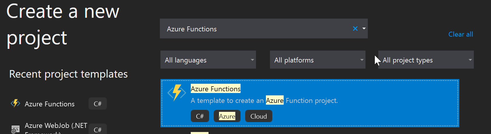

1. Give the project a name and click "Create"
    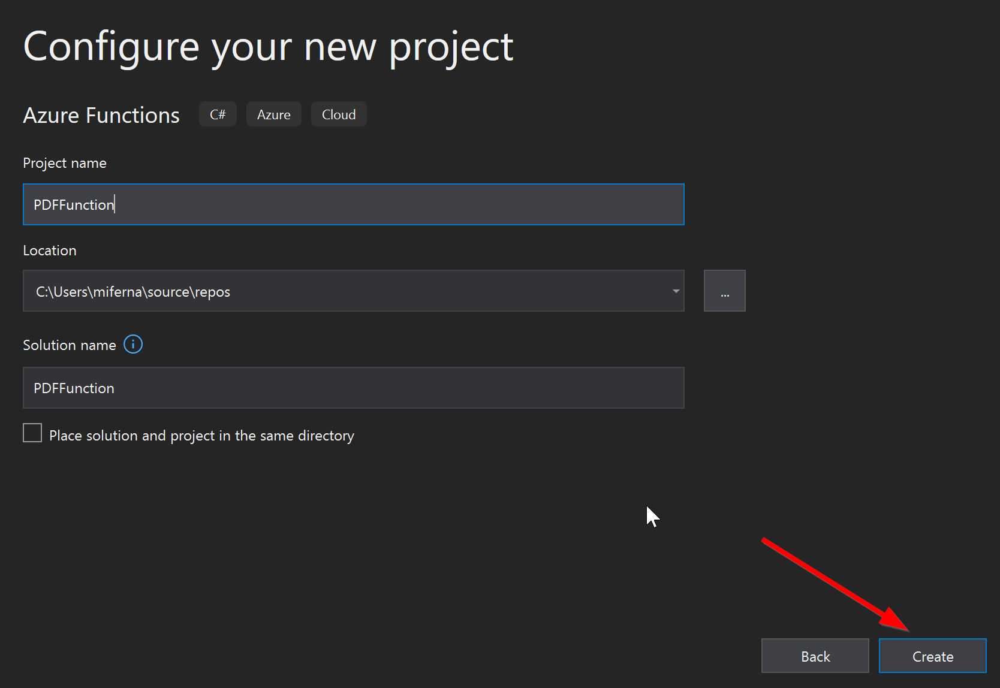

1. Select the Http trigger option. Leave other settings at their default values
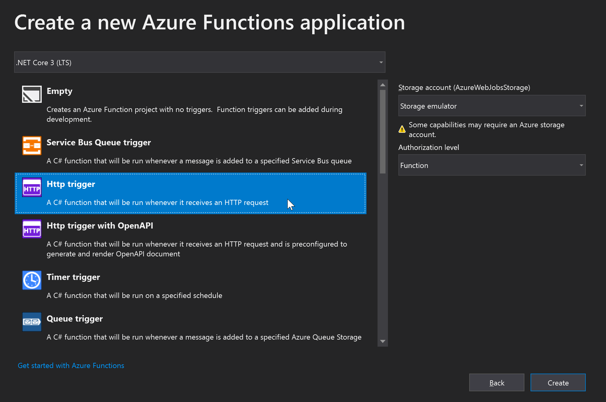

1. Once the project is created, right-click on the project in the solution explorer and select Manage Nuget Packages
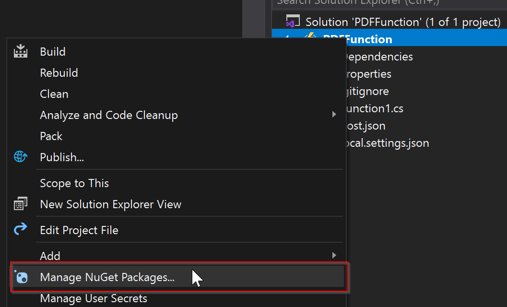
1. We will need to add the following Nuget Packages:
    * DinkToPdf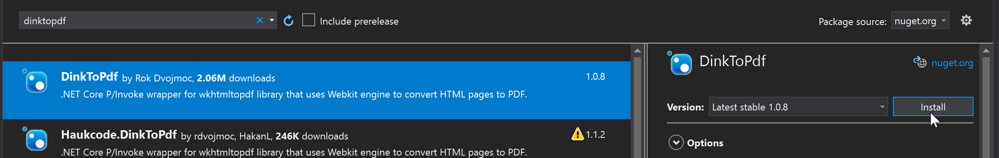
    * Microsoft.Azure.Functions.Extensions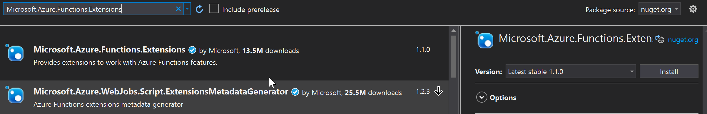
    * Microsoft.Extensions.DependencyInjection (version 3.x)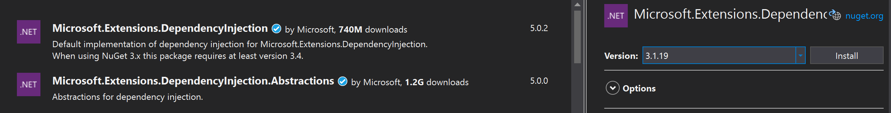
    >The Microsoft.Azure.Functions.Extensions and Microsoft.Extensions.DependencyInjection packages are needed since we will be using dependency injection to inject the converter into the function code. This document outlines the process in detail <https://docs.microsoft.com/en-us/azure/azure-functions/functions-dotnet-dependency-injection>
1. Add a new `Startup.cs` class to the project
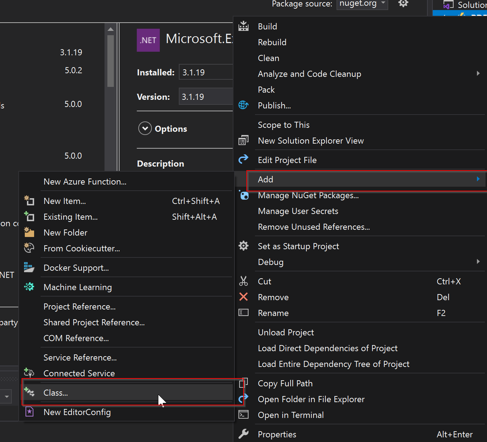

1. Paste the following code into `Startup.cs`:

    ```c#
    using DinkToPdf;
    using DinkToPdf.Contracts;
    using Microsoft.Azure.Functions.Extensions.DependencyInjection;
    using Microsoft.Extensions.DependencyInjection;

    [assembly: FunctionsStartup(typeof(PDFFunction.Startup))]

    namespace PDFFunction
    {

        public class Startup : FunctionsStartup
        {
            public override void Configure(IFunctionsHostBuilder builder)
            {


                builder.Services.AddSingleton(typeof(IConverter), new BasicConverter(new PdfTools()));
            }
        }

    }
    ```

    >Note: depending on what you named your app, the namespace will change accordingly. Please change this in the code as well after pasting it. For example, my app was named PDFFunction but if my app had been named FunctionAppTest these 2 lines would change in the code accordingly:
        ```[assembly: FunctionsStartup(typeof(FunctionAppTest.Startup))]```
            and
        ```namespace FunctionAppTest```

1. In the `Function1.cs` class paste the following code:

    ```c#
    using DinkToPdf;
    using Microsoft.AspNetCore.Http;
    using Microsoft.AspNetCore.Mvc;
    using Microsoft.Azure.WebJobs;
    using Microsoft.Azure.WebJobs.Extensions.Http;
    using Microsoft.Extensions.Logging;
    using System;
    using System.Threading.Tasks;

    namespace PDFFunction
    {
        public class Function1
        {
            private readonly DinkToPdf.Contracts.IConverter _converter;

            public Function1(DinkToPdf.Contracts.IConverter converter)
            {
                this._converter = converter;
            }
            [FunctionName("Function1")]

            public async Task<IActionResult> Run(
                [HttpTrigger(AuthorizationLevel.Function, "get", "post", Route = null)] HttpRequest req,
                ILogger log)
            {
                log.LogInformation("C# HTTP trigger function processed a request.");
                try
                {
                    ConvertHTML2PDF();
                }
                catch (Exception ex)
                {

                    return new OkObjectResult(ex.Message);

                }


                return new OkObjectResult("Converted HTML to PDF");
            }

            private void ConvertHTML2PDF()
            {
                var doc = new HtmlToPdfDocument()
                {
                    GlobalSettings = {
                        ColorMode = ColorMode.Color,
                        Orientation = Orientation.Portrait,
                        PaperSize = PaperKind.A4,
                        Margins = new MarginSettings() { Top = 10 },
                        Out = @"c:\temp\PDFs\Document1.pdf",
                    },
                    Objects = {
                    new ObjectSettings() {
                        PagesCount = true,
                        HtmlContent = @"Lorem ipsum dolor sit amet, consectetur adipiscing elit. In consectetur mauris eget ultrices  iaculis. Utodio viverra, molestie lectus nec, venenatis turpis.",
                        WebSettings = { DefaultEncoding = "utf-8" },
                        HeaderSettings = { FontSize = 9, Right = "Page [page] of [toPage]", Line = true, Spacing = 2.812 }
                    }
                }
                };

                _converter.Convert(doc);
            }
        }
    }
    ```

1. Change this line of code to point to an existing folder in your local environment:

    ```c#
    Out = @"c:\temp\PDFs\Document1.pdf"
    ```

1. Save and start debugging (F5)

1. After a few seconds you will see this screen:
    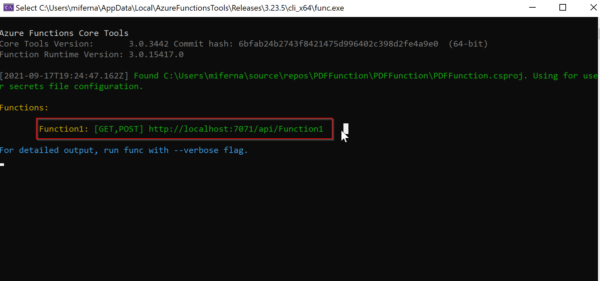
    Copy the URL and paste it into your browser and press enter. This will trigger your function to start.
1. You should see logs showing that the function started and executed successfully
    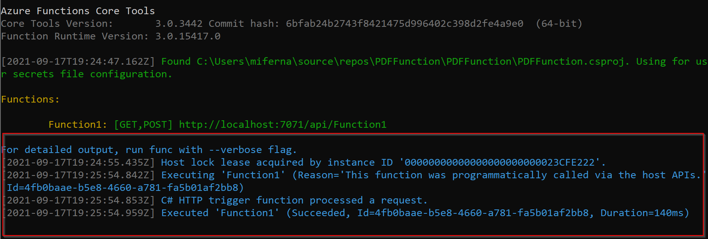
    Copy the URL and paste it into your browser and press enter. This will trigger your function to start.
1. However, the execution won't be successful. In your browser window you will see this error:
    >   Unable to load DLL 'libwkhtmltox' or one of its dependencies: The specified module could not be found. (0x8007007E)

    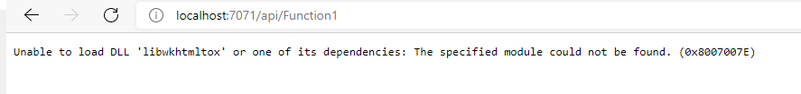
    This is because we are missing the libwkhtmltox library. In our case we will downlaod the 64 bit Windows dll found here <https://github.com/rdvojmoc/DinkToPdf/tree/master/v0.12.4/64%20bit>
1. Once the file is downloaded copy it to your root project folder

    
1. You should see the file in the project explorer window in Visual Studio. In the file's properties change the Copy To Output Directory option to Copy always

    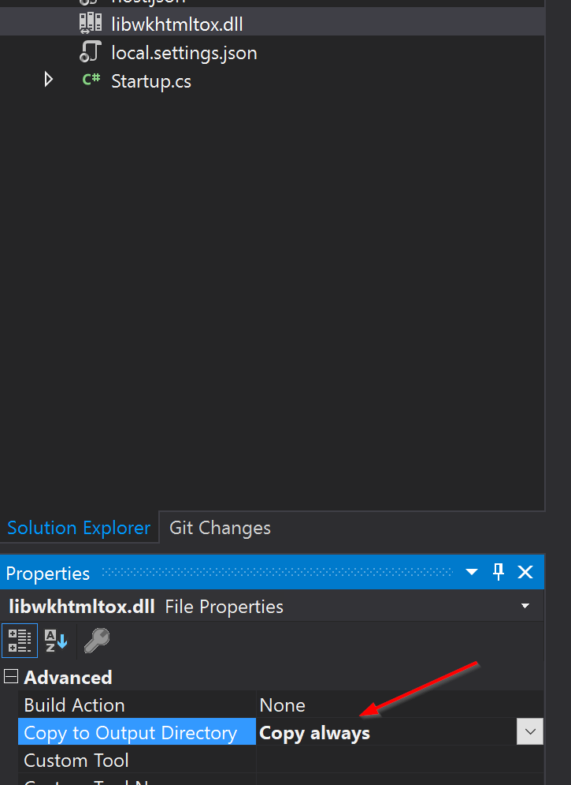
1. Rebuild the solution and start debugging again. Navigate back to the local host URL to trigger the function again. This time in the corresponding local folder you should see the file was created

    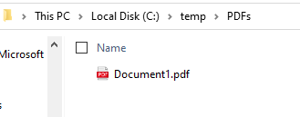
1. Opening the file shows its contents are rendered as expected

    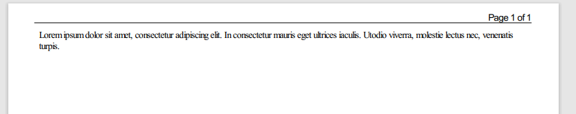

## Publish the function app to Azure

1. In the `function1.cs` class we will change the value of the output property for the GlobalSettings object to point to a directory that we can get to on the App Service's files. Change it to `Out = @"d:\home\Document1.pdf"`

1. Right-click on the project in the project explorer and click publish
    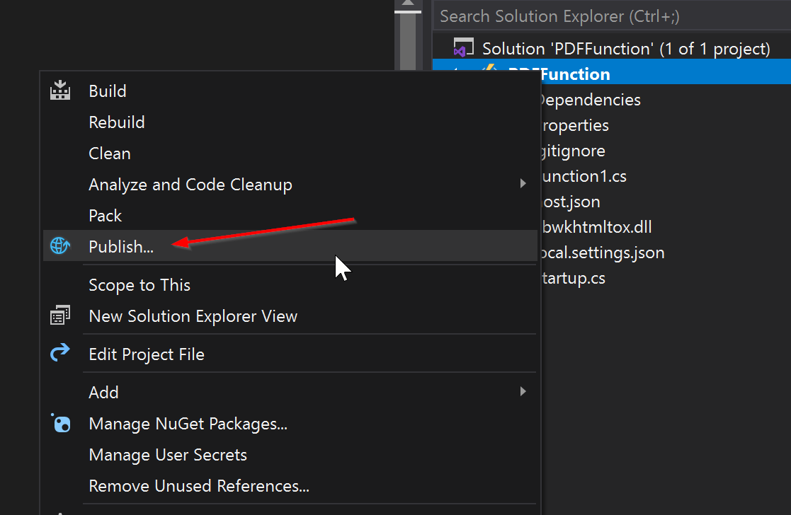
1. Select Azure as the target
    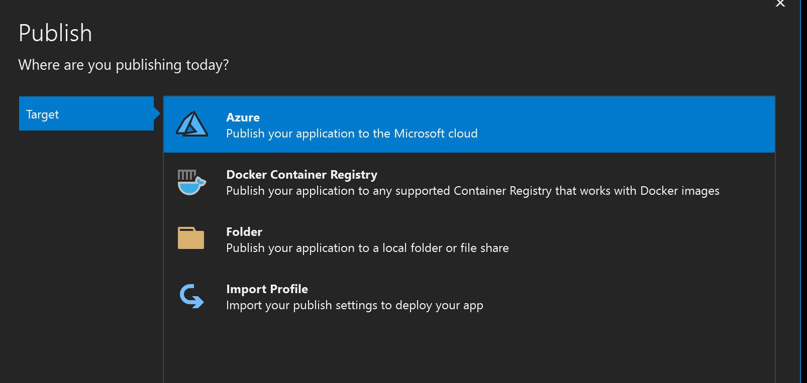
1. Select Azure Function App (Windows) as the Specific Target
    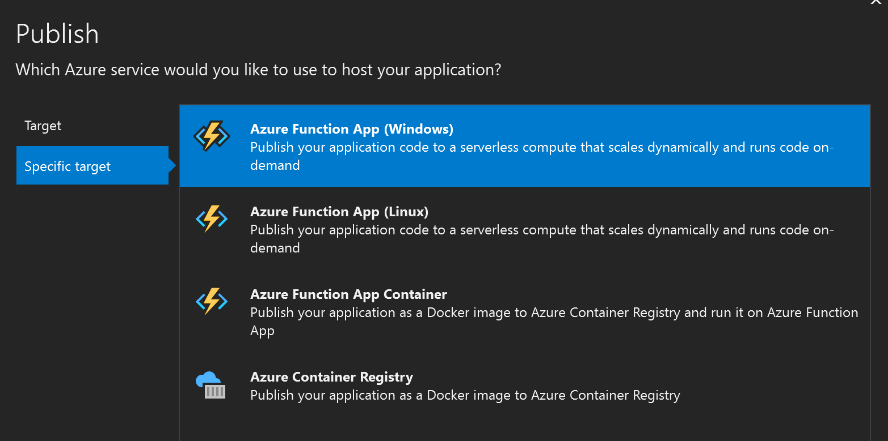
1. On the next screen you will need to sign in to your Azure account if not already logged in
    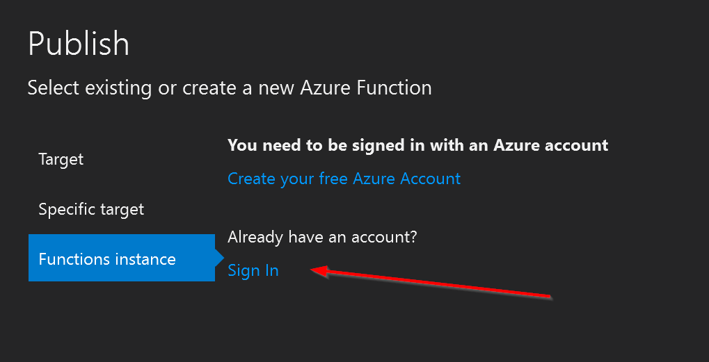
1. Click the green plus icon to create a new function
    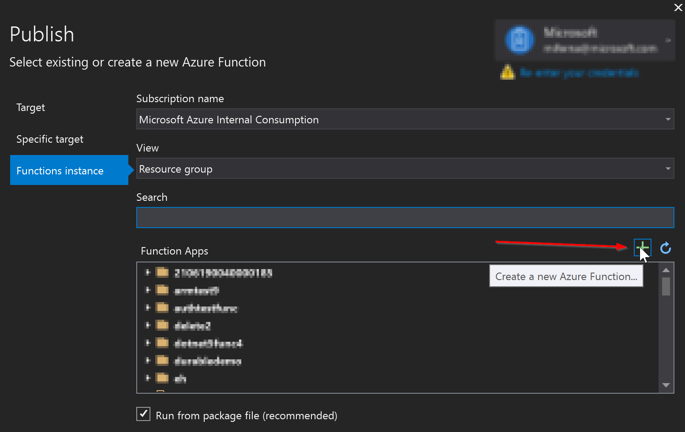
1. As mentioned, this function app needs to be deployed to an App Service Plan in order for it to render correctly. Note the Plan Type selected in the dropdown. If you don't have an existing App Service Plan you can also create one on this screen.
    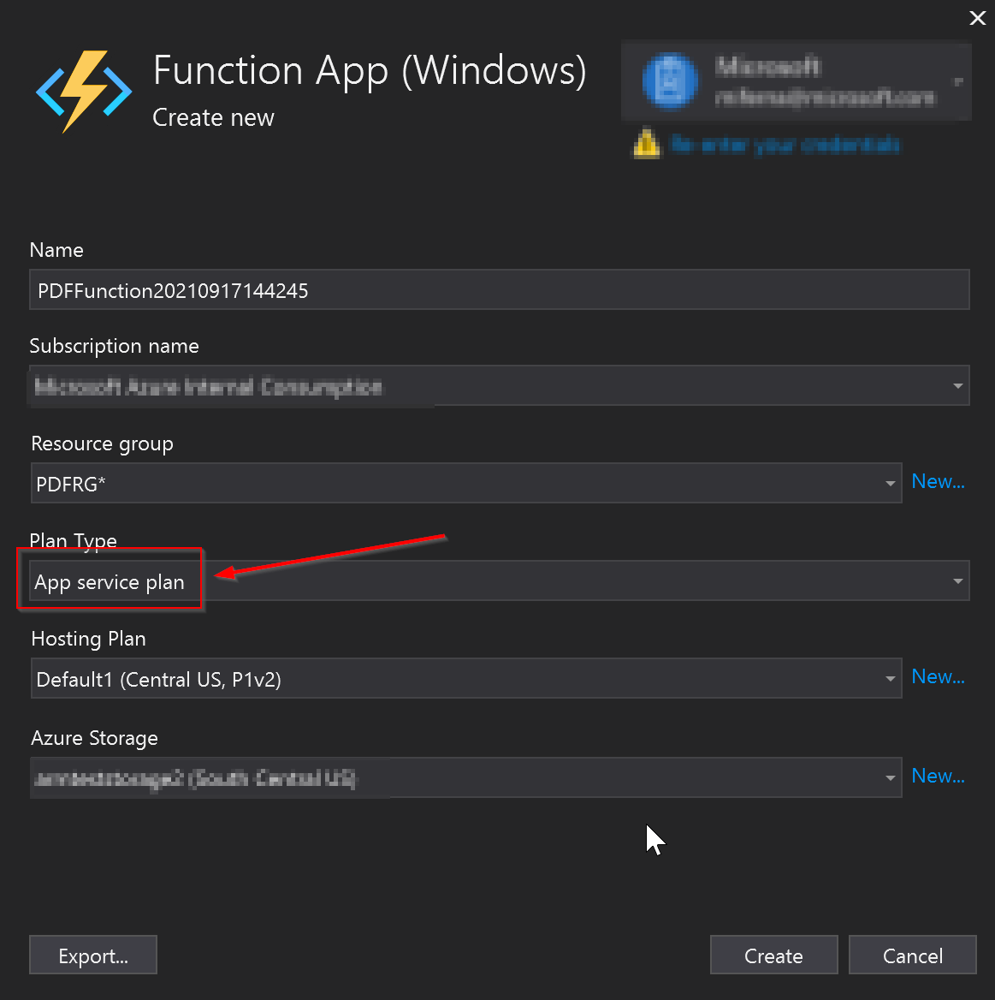
1. After clicking "Create" it will take a few minutes to create the resources on Azure. Once the process ends, click on Finish

    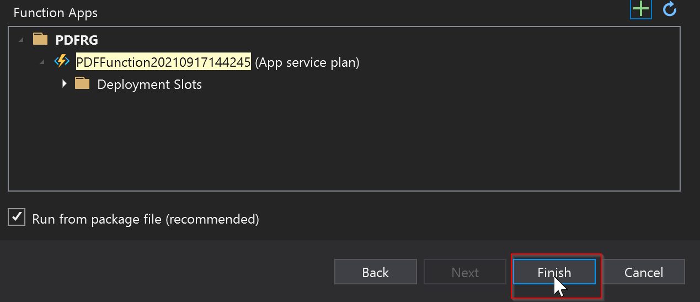
1. Finally click on Publish

    
1. Once the app is published go to the Azure portal, portal.azure.com, and search for the name of the newly created app. Click on it and go to the Functions option and then click on Function1

    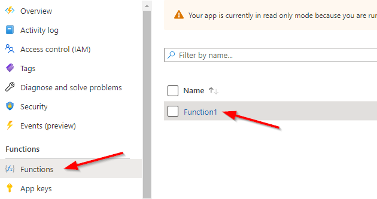
1. Click on code + test and then on Test/Run

    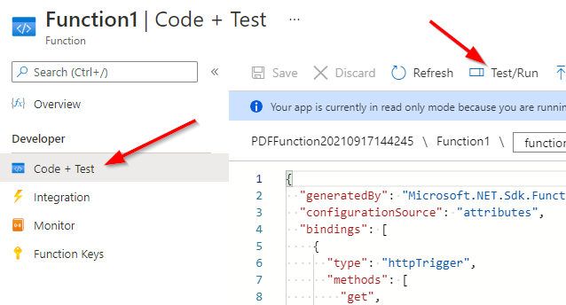
1. Click Run, this will trigger the function

    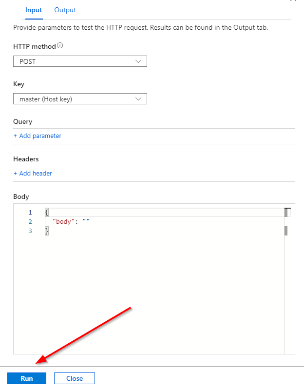
1. You will notice an exception message:
    > An attempt was made to load a program with an incorrect format. (0x8007000B)

    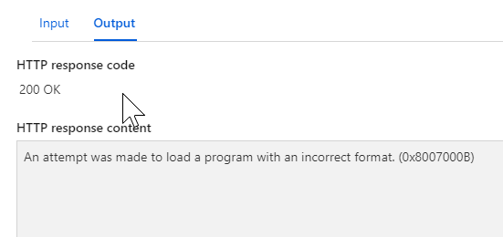

    This is because we are using the 64 bit version of the libwkhtmltox dll but our app on Azure is set to 32 bit by default
1. We can fix that in the Configuration -> General Settings tab of the function app by setting the Platform dropdown to 64-bit

    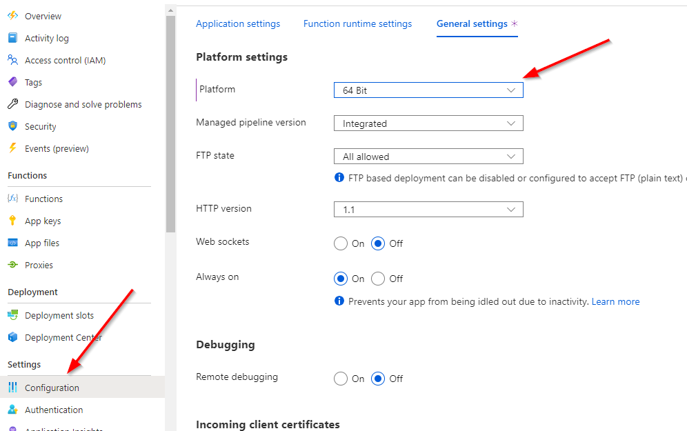
1. Now if we go back to the test/run section of the Function1 function and run it again we should see that the exception doesn't appear.

    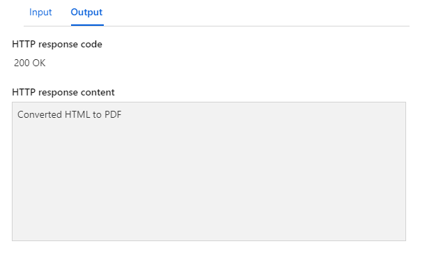
1. We can check if the file was created by going the app's kudu site. Go to the Advanced Tools options and Click on Go

    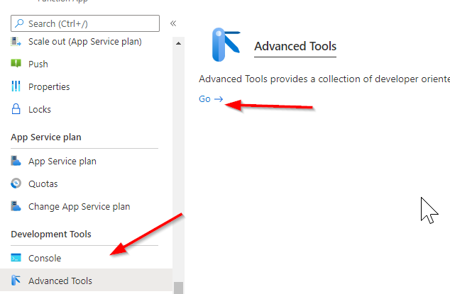

1. Click on Debug Console -> CMD

    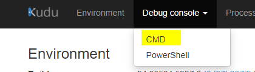

1. You should now be at the d:\home location that we specified in the code as the location where the file would be saved. The PDF document should be in the folder. Click on the download icon to the left side of the file to download it

    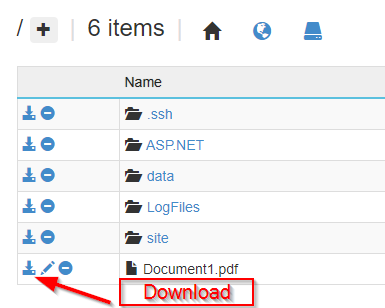
1. It should open and render correctly

    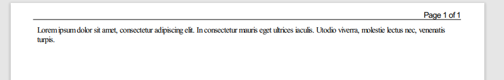

## Next Steps

### You can now modify the code as needed to meet your needs. For example, instead of saving the file locally you can upload it to an Azure Storage Account blob container
